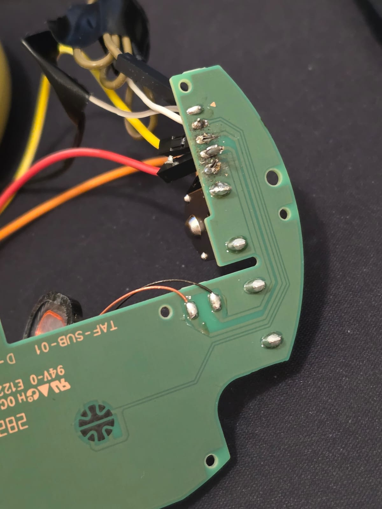
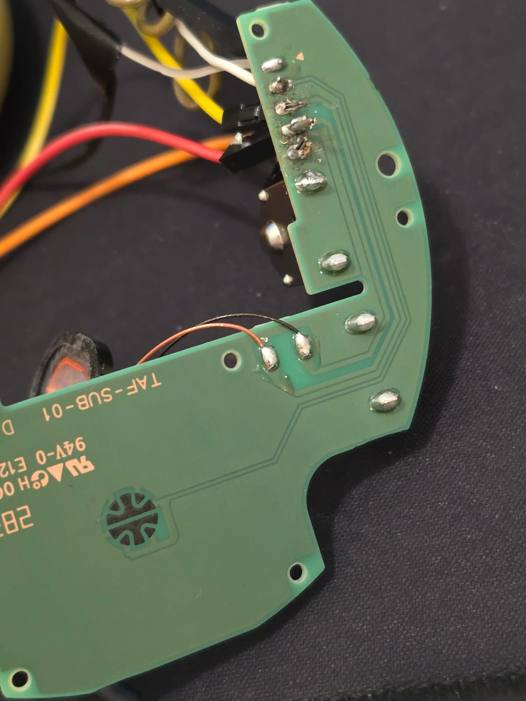
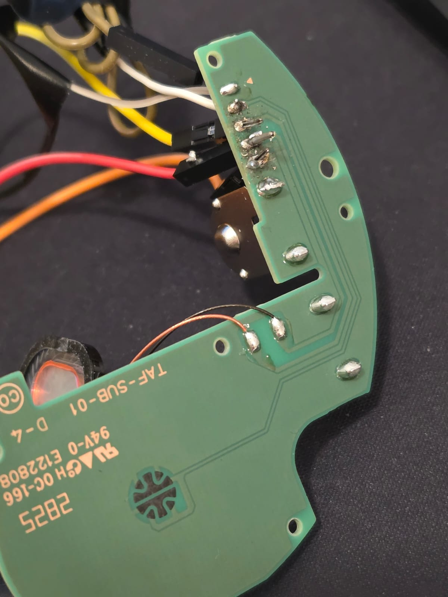
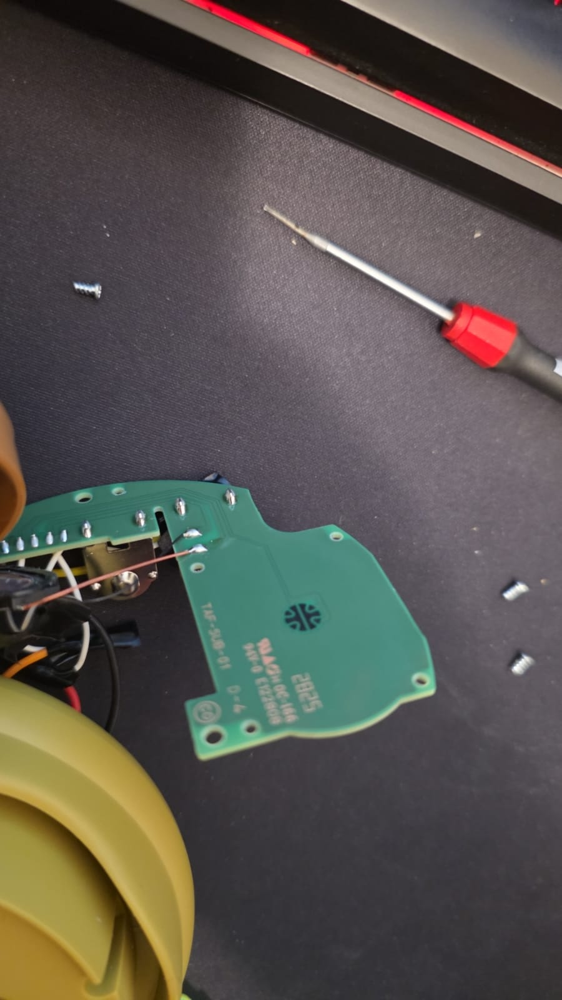
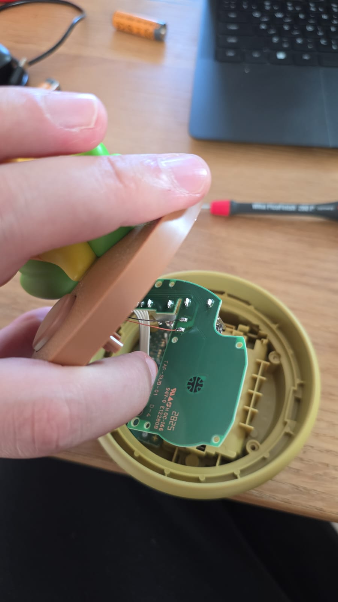
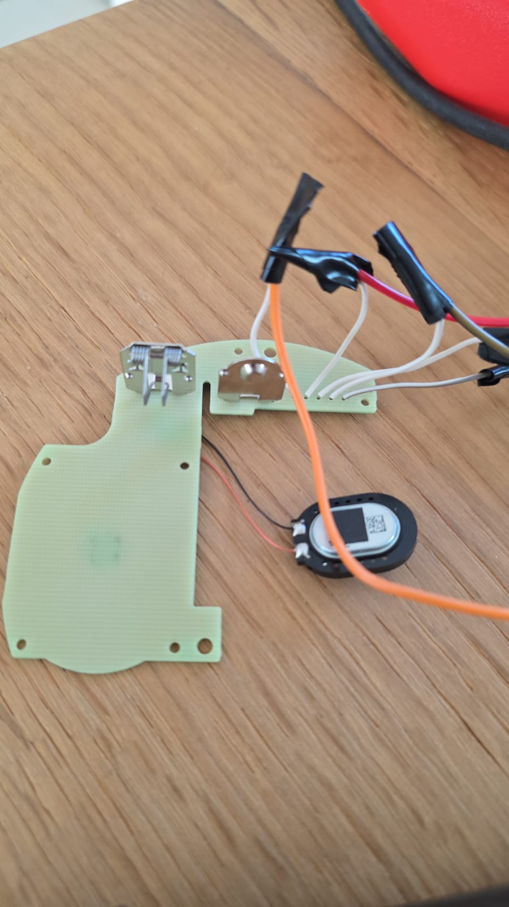
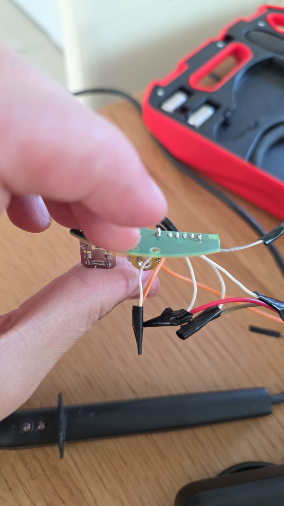
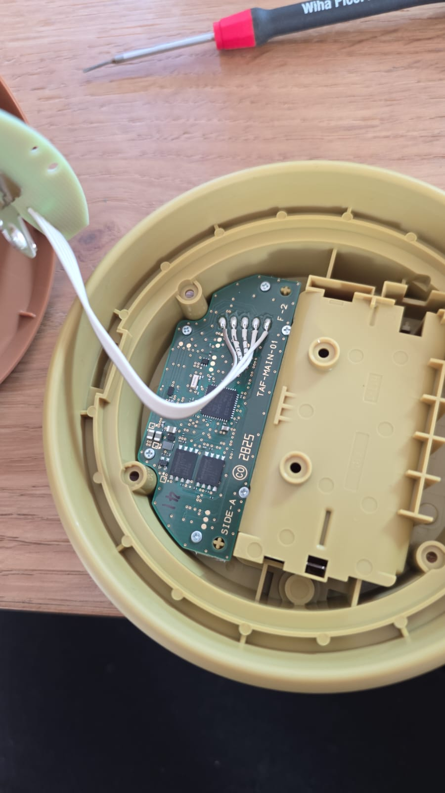
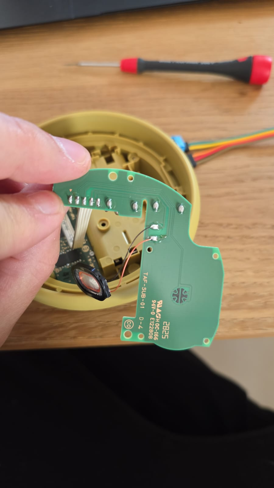
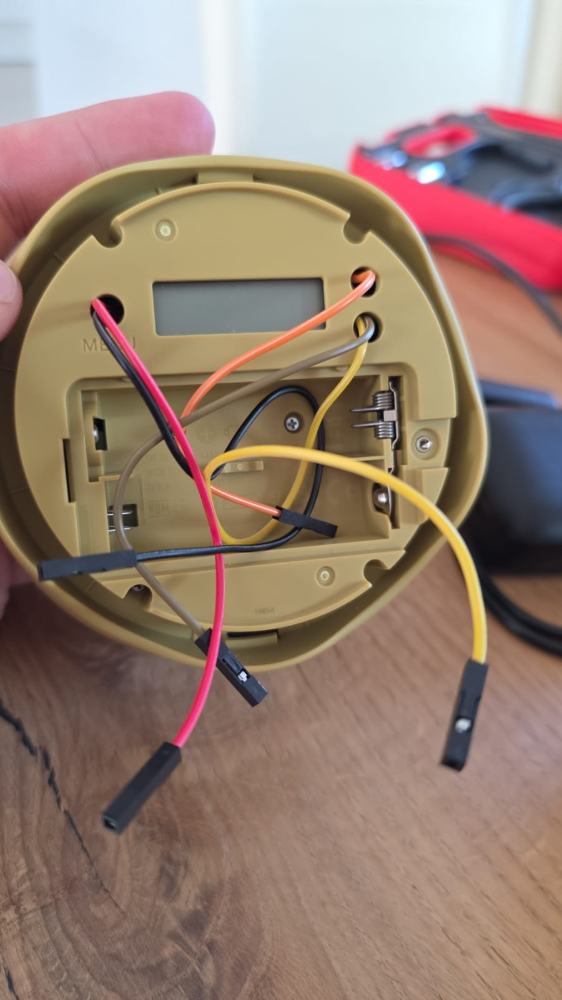

# Guida completa — AI Flower Voice Assistant

Setup reale e funzionante. Documenta la configurazione con cui il fiore parla, risponde, e gestisce bottone + push-to-talk.

## Fotografie della build

Riferimento visivo. Se la tua sub-board non è identica a queste foto, **non copiare i colori dei cavi alla cieca** — le revisioni PCB del giocattolo cambiano e anche i colori sono una scelta personale. Usa sempre il continuity test per verificare.

### Sub-board

<p align="center">
  
  
</p>

Retro della sub-board (lato tracce). Si vedono i 5 Dupont M-F saldati direttamente ai pad del ribbon (più robusto del metodo splice + heatshrink). Si notano:
- I pad dello speaker con due fili rame/rosso saldati (in basso)
- La staffa metallica nella zona centrale (parte del meccanismo di mounting)
- I pad del bottone dome switch (cerchio con croce + anello in basso)

<p align="center">
  
  
</p>

### Soldering in progress

<p align="center">
  
  
</p>

<p align="center">
  
  
</p>

<p align="center">
  
  
</p>

**Note sulle foto:**
- La sub-board viene tenuta FUORI dal guscio di plastica durante la saldatura — niente plastica vicina al saldatore, zero rischio di fondere il vaso.
- I pad del ribbon sono circolari, piccoli (~1.5 mm), pre-stagnati — basta scaldare e infilare il filo nudo del Dupont.

---

## Hardware — cablaggio finale

### Cavetti saldati alla sub-board

5 Dupont M-F saldati direttamente sui pad del ribbon cable della sub-board. Colori della build di riferimento (tu puoi usare quelli che vuoi, basta ricordarli):

| Colore | Funzione | Verificato via |
|--------|----------|---------------|
| **BIANCO** | Bottone — contatto centrale del dome switch | Continuity test |
| **MARRONE** | Bottone — anello esterno del dome switch | Continuity test |
| **GIALLO** | Speaker (lato +) | Continuity test + audio test |
| **ROSSO** | Speaker (lato −) | Continuity test + audio test |
| **ARANCIO** | Batteria (NON USATO) | Isolato con nastro |

**Nota:** il cablaggio esatto dipende dalla revisione PCB del tuo giocattolo. Non fidarti delle tabelle a priori — verifica sempre con continuity test.

### MAX98357A (ampli I2S)

Saldato: pettine 7 pin + morsetto a vite blu.

**GAIN pin (pos 4) → Pi pin 14 (GND)** via cavo jumper. Imposta guadagno massimo hardware (15 dB).

**5 cavi Dupont F-F MAX pettine → Pi:**

| Pin pettine MAX | Pi pin fisico |
|-----------------|---------------|
| VIN (pos 7) | pin 2 (5V) |
| GND (pos 6) | pin 6 (GND) |
| BCLK (pos 2) | pin 12 (GPIO18) |
| LRC (pos 1) | pin 35 (GPIO19) |
| DIN (pos 3) | pin 40 (GPIO21) |

Pin SD (pos 5) e GAIN (pos 4) gestiti a parte.

**Speaker MAX → Fiore:** i due fili dello speaker vanno al morsetto blu della MAX98357A (lato + e −). Entrambi servono (uscita differenziale class-D).

### Bottone → Pi

- BIANCO (fiore) → Pi **pin 11** (GPIO17, pull-up interno)
- MARRONE (fiore) → Pi **pin 9** (GND)

Premendo il bottone del fiore si cortocircuita GPIO17 a GND.

### Microfono USB

C-Media USB PnP Sound Device via OTG micro-USB adapter sulla porta "USB" (non "PWR IN") del Pi.

## Card ALSA

Con il mic USB connesso tipicamente si vede:
- `card 0` = MAX98357A (playback)
- `card 1` = USB PnP Sound Device (capture, mic)
- `card 2` = vc4hdmi (unused)

I numeri possono variare tra boot. `.asoundrc` e il codice referenziano le card per **nome** (`CARD=MAX98357A`, `CARD=Device`), quindi non dipendono dal numero.

## Software — configurazione

### `~/.asoundrc` sul Pi

```
pcm.dmixer {
    type dmix
    ipc_key 1024
    slave {
        pcm "hw:CARD=MAX98357A,DEV=0"
        period_size 2048
        buffer_size 16384
        rate 48000
        channels 1
        format S32_LE
    }
}

pcm.softvol {
    type softvol
    slave.pcm "dmixer"
    control { name "SoftMaster"; card MAX98357A }
    min_dB -20.0
    max_dB 0.0
}

pcm.speaker {
    type plug
    slave.pcm "softvol"
}

pcm.!default {
    type asym
    playback.pcm "speaker"
    capture.pcm "plughw:CARD=Device,DEV=0"
}
```

### Pacchetti apt obbligatori (installati da `flower_firstboot.sh`)

```
python3 python3-pip python3-venv python3-dev libpython3-dev
alsa-utils mpg123 ffmpeg sox libportaudio2
git curl unzip swig
libatlas-base-dev libffi-dev liblgpio-dev
build-essential
```

**Se manca `mpg123` → la TTS produce MP3 ma non li riesce a riprodurre.**

### Mic capture gain

```
sudo amixer -c 1 cset numid=3 16    # max volume (il numid può differire per modello)
sudo amixer -c 1 cset numid=4 on    # AGC on
sudo alsactl store
```

### Silence streamer (impedisce il pop dell'ampli)

Vedi `systemd/flower-silence.service` nel repo:

```
[Unit]
Description=Flower I2S silence streamer (prevents amp power-down pop)
After=sound.target

[Service]
User=pi
ExecStart=/usr/bin/aplay -D speaker -f S16_LE -r 48000 -c 1 /dev/zero
Restart=always
RestartSec=5

[Install]
WantedBy=multi-user.target
```

**Nota:** `User=pi` è obbligatorio (altrimenti non trova `~/.asoundrc`), e il device `speaker` (alias dmixer) evita di tenere `hw:CARD=MAX98357A` esclusivo.

### PicoClaw (LLM gateway)

Installato come binario scaricato da GitHub Releases:

```
cd /tmp
curl -L -o picoclaw.tar.gz https://github.com/sipeed/picoclaw/releases/download/v0.2.6/picoclaw_Linux_arm64.tar.gz
tar xzf picoclaw.tar.gz
sudo mv picoclaw /home/pi/picoclaw
sudo chmod +x /home/pi/picoclaw
```

### LLM provider — OpenAI gpt-4o-mini (consigliato, ~€1-4/mese)

Dopo vari test (Groq free rate-limited, OpenRouter free saturo, DeepSeek ok ma con registrazione complicata), **OpenAI gpt-4o-mini** è la soluzione consigliata:

- Costo: ~$0.0006/query = **~€1-4/mese** per uso personale (50-200 chat/giorno)
- Nessun rate limit pratico
- Qualità ottima per conversazione in italiano
- Risposta in ~1-3 secondi

Setup:
1. Vai su https://platform.openai.com/api-keys
2. Crea API key (formato `sk-proj-...`)
3. Aggiungi credito su https://platform.openai.com/settings/organization/billing (minimo $5, dura mesi)

**Alternative gratuite meno affidabili** (se vuoi evitare spesa):
- **Groq** (`gsk_...`) — free tier veloce ma rate-limited
- **Google Gemini** via AI Studio — free tier generoso
- **DeepSeek V3** — ancora più economico di gpt-4o-mini

### `~/.picoclaw/config.json`

Usa `picoclaw-config.example.json` del repo come template, poi **non committare la tua copia** (c'è un entry apposito nel `.gitignore`).

### `~/.picoclaw/.security.yml` (qui va la API key vera)

PicoClaw v0.2.6+ ha migrato le API keys fuori dal `config.json` per sicurezza. Vanno in un file separato:

```yaml
channels: {}
model_list:
  kimi-turbo:0:
    api_keys:
      - REPLACE_WITH_YOUR_API_KEY
```

**Nome della chiave:** `<model_name>:<indice_nel_model_list>` → nel nostro caso `kimi-turbo:0`.

**Gotcha critici:**
- Senza `gateway.port`, il service fallisce con "invalid gateway port: 0".
- Senza `.security.yml` correttamente popolato, ricevi errori 401 "Invalid API Key" anche se la key è nel config.json.
- Dopo il primo avvio PicoClaw rinomina `api_key` → `api_keys` in config.json e mette `[NOT_HERE]` — non preoccuparti, la key vera sta in `.security.yml`.

### `voice-assistant/.env` — gotcha critico

```
FLOWER_MODE=1
CUSTOM_SOUNDS_DIR=/home/pi/ai-flower-assistant/voice-assistant/sounds
```

**Se `CUSTOM_SOUNDS_DIR=` è vuoto (con `=` ma niente dopo), il default del codice viene overridden con Path vuoto → le funzioni come `get_quip_wav()` ritornano None → niente audio sul tap.** Lascia la variabile completamente fuori dal file per usare il default, oppure impostala a un percorso valido.

### Systemd services

Come utente `pi`, copia i file in `systemd/` dentro `/etc/systemd/system/`:

- `flower-voice.service` — il voice assistant principale
- `flower-silence.service` — silence streamer per l'ampli
- `picoclaw-gateway.service` — il gateway LLM

Poi:

```
sudo systemctl daemon-reload
sudo systemctl enable --now picoclaw-gateway flower-voice flower-silence wifi-powersave-off
```

## Uso — gestures del bottone

**Importante:** il codice registra **dopo** il rilascio, non durante l'hold. Quindi:

### Push-to-talk (PTT)

1. Premi e **tieni premuto per ~2 secondi** (qualsiasi cosa > 0.3 s conta come hold).
2. **Rilascia** il bottone.
3. **Adesso** parla — la registrazione è attiva, non prima.
4. Smetti di parlare. Dopo 1.5 s di silenzio la registrazione si ferma da sola (VAD).
5. Aspetta 2-4 s per STT + LLM + TTS.
6. Il fiore risponde.

### Altre gestures

| Gesture | Effetto |
|---------|---------|
| Tap singolo breve | Frase random ("quip") da `sounds/quips/` |
| Double-tap | Toggle idle chatter (on/off) |
| Triple-tap | Reset memoria conversazione |
| Quadruple-tap | Music mode (plays `sounds/music/*.wav`) |
| Quintuple-tap | Messaggio speciale da `sounds/special/` |

## Troubleshooting

### "Si sente solo rumore disturbato, niente voce"

Manca `mpg123`. Installa con `sudo apt install -y mpg123`.

### "Bottone non rilevato"

1. Controlla pin: BIANCO su pin 11, MARRONE su pin 9.
2. Se ancora niente, usa `scripts/button_live_test.py` per verificare GPIO17.
3. Se funziona con un ponte diretto Pi 9-11, il problema è nel cablaggio del fiore — fai continuity test.

### "Tutti i pin leggono LOW a riposo"

Ponte di stagno tra pad adiacenti sulla sub-board. Ispeziona e pulisci con saldatore + treccia dissaldante.

### "LLM risponde con help text di PicoClaw"

Il modello configurato non esiste più o è rate-limited. Aggiorna `~/.picoclaw/config.json` con un modello attuale.

### "STT traduce italiano in inglese"

`transcribe_elevenlabs()` deve avere `language_code: "it"`. Già correttamente fissato nel repo (vedi `voice-assistant/voice_assistant.py`).

### "La voce è troppo forte/distorta"

Abbassa `max_dB` in `~/.asoundrc` (da 0 a -5 o -10). Oppure `amixer -c 0 set SoftMaster 80%`.

### "Non si connette al WiFi dopo flash"

- Il Pi Zero 2 W supporta solo 2.4 GHz. Usa una rete 2.4.
- Se il router è in mixed mode WPA2/WPA3, aggiungi `auth: { key-management: psk }` al `network-config` per forzare WPA2 only.
